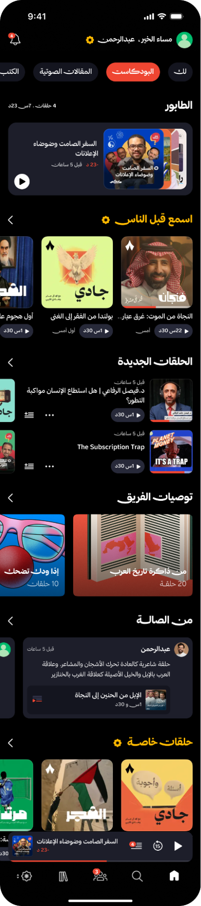

# تكليف مطور الجوال (Mobile Developer Assignment)

## الهدف
الهدف من هذا التكليف هو تقييم مهاراتك في بناء واجهات مستخدم معقدة وديناميكية، وقدرتك على التعامل مع واجهات برمجة التطبيقات (APIs)، وتحليل المشكلات للوصول إلى أفضل حل تقني يلائم بيئة التطبيق.

## التكليف
يتكون التطبيق من شاشة رئيسية واحدة تحتوي على عدة أقسام، وتعرض كل قسم نوعًا مختلفًا من المحتوى (بودكاست، حلقات، كتب صوتية، مقالات صوتية). الشاشة الرئيسية تحتوي على عدة عناصر بشكل شبكي، ويتم تحديث المحتوى بشكل ديناميكي عبر واجهة برمجة التطبيقات (API).

### المطلوب منك تنفيذ الآتي:

#### بناء الشاشة الرئيسية:
*   يتم عرض الأقسام في الشاشة الرئيسية بطريقة قابلة للتمرير اللانهائي.
*   لكل قسم نوع عرض معين: (شبكة ثنائية، شبكة مربعات).
*   يجب أن يتم عرض الأقسام بناءً على بيانات يتم جلبها من نقطة الوصول API (الرابط سيتم توفيره).

#### تنفيذ وظيفة الاتصال بنقطة الوصول:
*   يجب بناء طلب GET إلى نقطة الوصول المحددة لاسترجاع الأقسام والمحتوى الخاص بها.
*   يتضمن الرد الخاص بـ API معلومات عن كل قسم، مثل: اسم القسم، نوعه، نوع المحتوى المعروض (بودكاست، حلقات، كتب صوتية، مقالات صوتية)، وترتيب عرض الأقسام.

#### تحديث واجهة المستخدم:
*   عرض المحتوى داخل الأقسام بناءً على النوع المطلوب (مثل عرض الحلقات بشكل أفقي أو الكتب الصوتية كمربعات كبيرة).
*   يجب أن تكون الأقسام قابلة للتحديث لتتغير بشكل تلقائي مع تغير البيانات.

#### كتابة Unit Tests للوحدات المنطقية:
*   حاول كتابة اختبارات للوحدات المنطقية قدر المستطاع.

#### بناء شاشة البحث:
*   قم بتطوير شاشة ثانية للبحث (بإضافة زر البحث في أي مكان).
*   شكل النتائج يشابه طريقة عرض الأقسام في الشاشة الرئيسية.
*   يجب تأخير تنفيذ عملية البحث لمدة 200 مللي ثانية بعد توقف المستخدم عن الكتابة.
*   تجنب الطلبات المتكررة غير الضرورية للخادم.

## نقاط الوصول واجهة التطبيق (API)
*   أقسام الصفحة الرئيسية: `https://api-v2-b2sit6oh3a-uc.a.run.app/home_sections`
*   البحث: `https://mock.apidog.com/m1/735111-711675-default/search`

## متطلبات تقنية للـ iOS
*   استخدام معمارية MVVM لهيكلية التطبيق.
*   تطوير الواجهة باستخدام SwiftUI.
*   استخدام Swift Concurrency (Async/Await) لمعالجة البيانات.
*   الاعتماد على Swift Package Manager لإدارة المكتبات الخارجية.

## نقاط اضافية (اختياري)
*   كتابة UI test واحد أو أكثر بشكل Maintainable وقابل للتوسع والتعديل مستقبلا.
*   في الـ iOS: استخدام SwiftUI لشاشة وUIKit لشاشة أخرى.

## بعد الانتهاء
بعد إتمام التطبيق، نود منك كتابة مستند بسيط يشرح الحل الذي قدمته، يتضمن ما يلي:
1.  شرح موجز لطريقة حلك للمشكلة.
2.  التحديات والصعوبات التي واجهتها أثناء التنفيذ.
3.  أفكار أو اقتراحات لتحسين الحل أو تطبيقه بطريقة مختلفة.

هذا التكليف يعتبر فرصة لإظهار إبداعك في تقديم واجهة مستخدم ديناميكية وسهلة التفاعل مع مختلف أنواع المحتوى. نتمنى لك التوفيق!
